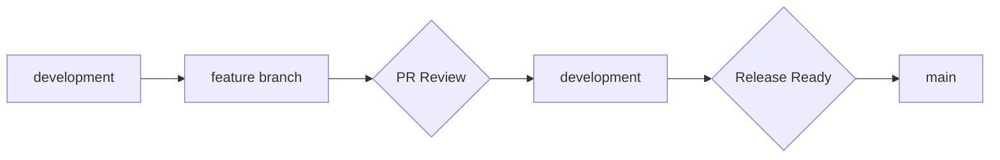

# Development Workflow Design Decisions

## Overview
This document outlines a simple, maintainable branching strategy and development workflow using GitHub. The workflow is designed for a small team while ensuring code quality and stability.

## Branch Strategy

### Core Branches
```typescript
interface Branches {
  main: {
    purpose: "Production-ready code";
    protection: true;
    requiresApproval: true;
    autoDeployTo: "production";
  };
  
  development: {
    purpose: "Integration branch";
    protection: true;
    requiresApproval: false;
    autoDeployTo: "development";
  };
}
```

### Feature Development
```
main
 │
 ├── development
 │   ├── feature/add-account-import
 │   ├── feature/transaction-search
 │   └── bugfix/import-validation
```

### Branch Naming
```typescript
interface BranchNaming {
  feature: "feature/{ticket-id}-{description}";
  bugfix: "bugfix/{ticket-id}-{description}";
  hotfix: "hotfix/{ticket-id}-{description}";
}

// Examples
const branchExamples = [
  "feature/HF-123-add-import-validation",
  "bugfix/HF-456-fix-balance-calculation",
  "hotfix/HF-789-auth-security-fix"
];
```

## Development Process

### 1. Feature Development


### 2. Work Items
```typescript
interface WorkItem {
  branch: string;
  type: "feature" | "bugfix" | "hotfix";
  status: "in-progress" | "review" | "testing" | "done";
  requirements: {
    unitTests: boolean;
    integrationTests: boolean;
    documentation: boolean;
    designReview?: boolean;
  };
}
```

### 3. Pull Request Process
```typescript
interface PullRequest {
  title: `[${WorkItem['type']}] Brief description`;
  template: {
    description: string;
    checklist: string[];
    testingNotes: string;
    screenshots?: string[];
  };
  reviews: {
    required: 1;
    codeOwners: boolean;
  };
}
```

## GitHub Configuration

### Branch Protection
```typescript
interface BranchProtection {
  main: {
    requirePullRequest: true;
    requiredReviews: 1;
    requireStatusChecks: true;
    enforceAdmins: true;
  };
  
  development: {
    requirePullRequest: true;
    requiredReviews: 1;
    requireStatusChecks: true;
    enforceAdmins: false;
  };
}
```

### Status Checks
```typescript
interface RequiredChecks {
  build: boolean;
  unitTests: boolean;
  linting: boolean;
  typeCheck: boolean;
}
```

## Workflow Examples

### 1. New Feature
```bash
# Start new feature
git checkout development
git pull origin development
git checkout -b feature/HF-123-add-import-validation

# Work on feature
git add .
git commit -m "feat: add import validation"

# Push and create PR
git push -u origin feature/HF-123-add-import-validation
# Create PR to development
```

### 2. Bug Fix
```bash
# Start bug fix
git checkout development
git pull origin development
git checkout -b bugfix/HF-456-fix-balance-calculation

# Fix bug
git add .
git commit -m "fix: correct balance calculation"

# Push and create PR
git push -u origin bugfix/HF-456-fix-balance-calculation
# Create PR to development
```

### 3. Production Release
```bash
# When development is ready for release
git checkout main
git pull origin main
git merge development
git push origin main
# CI/CD will handle deployment
```

## Pull Request Template
```markdown
## Description
[Describe the changes made and why]

## Type of Change
- [ ] Feature
- [ ] Bug Fix
- [ ] Hot Fix
- [ ] Documentation

## Testing
- [ ] Unit Tests Added/Updated
- [ ] Integration Tests Added/Updated
- [ ] Manually Tested

## Checklist
- [ ] Code follows style guidelines
- [ ] Comments added for complex logic
- [ ] Documentation updated
- [ ] Tests passing
- [ ] No new TypeScript errors
```

## Commit Message Format
```typescript
interface CommitMessage {
  format: `${type}(${scope}): ${description}`;
  types: ["feat", "fix", "docs", "style", "refactor", "test", "chore"];
  example: "feat(import): add transaction validation";
}
```

## Code Review Guidelines

### Review Checklist
1. Code Quality
   - Follows style guide
   - No obvious bugs
   - Proper error handling
   - Type safety

2. Testing
   - Adequate test coverage
   - Edge cases considered
   - Tests are meaningful

3. Security
   - No sensitive data exposed
   - Proper input validation
   - Security best practices followed

4. Performance
   - No obvious performance issues
   - Resource usage considered
   - Proper indexing used 