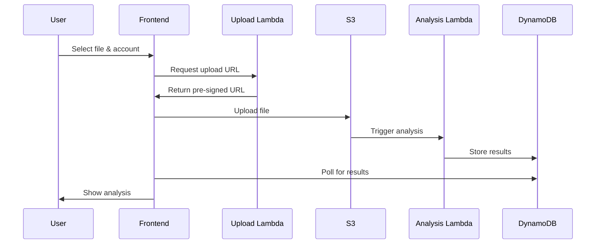

# Import Process Design Decisions

## Overview
This document outlines the design for importing transaction data from financial institution exports. The process consists of two main phases:
1. Initial file upload and validation
2. Transaction overlap analysis and confirmation

## File Upload Process

### Upload Flow
1. User selects account and file from web interface
2. Frontend gets pre-signed S3 URL from Upload Lambda
3. Frontend uploads directly to S3 using pre-signed URL
4. S3 event triggers Import Analysis Lambda
5. Analysis results stored in DynamoDB for review



### Upload Lambda Design
```typescript
interface UploadRequest {
  fileName: string;
  accountId: string;
  fileType: string;  // e.g., "CSV", "OFX"
  contentType: string;
}

interface UploadResponse {
  uploadUrl: string;
  uploadId: string;
  expiresIn: number;
}
```

### S3 Structure
```
housef2-imports/
├── pending/
│   └── {accountId}/
│       └── {uploadId}/
│           └── original.{ext}
├── processing/
│   └── {same structure}
└── processed/
    └── {same structure}
```

## Import Analysis Process

### Analysis Data Structure
```typescript
interface ImportAnalysis {
  uploadId: string;
  accountId: string;
  status: "ANALYZING" | "READY" | "ERROR";
  
  // File Statistics
  fileStats: {
    fileName: string;
    transactionCount: number;
    dateRange: {
      start: string;
      end: string;
    }
  };
  
  // Overlap Analysis
  overlapStats: {
    existingTransactions: number;
    newTransactions: number;
    potentialDuplicates: number;
    overlapPeriod: {
      start: string;
      end: string;
    }
  };
  
  // Sample Transactions
  sampleTransactions: {
    new: Transaction[];        // 3-5 examples
    existing: Transaction[];   // 3-5 from same period
    duplicates: {
      new: Transaction;
      existing: Transaction;
      similarity: number;
    }[];
  };
  
  errors?: string[];
}
```

### DynamoDB Import Status Table
```json
{
  "PK": "ACCOUNT#{accountId}",
  "SK": "IMPORT#{uploadId}",
  "status": "ANALYZING",
  "fileName": "statement.csv",
  "uploadTime": "2024-03-14T15:30:00Z",
  "analysisData": {
    // ImportAnalysis object
  }
}
```

## Confirmation Interface

### Required User Confirmations
1. Account Selection Verification
   - Show account name and last 4 digits
   - Display account balance and last transaction date
   - Confirm matching institution

2. Date Range Verification
   - Display date range of new transactions
   - Show overlap with existing transactions
   - Highlight any gaps in transaction dates

3. Transaction Sample Review
   - Display sample of new transactions
   - Show potential duplicates side by side
   - Allow user to adjust matching criteria

### Example Confirmation Dialog
```typescript
interface ImportConfirmation {
  uploadId: string;
  accountId: string;
  userConfirmations: {
    accountVerified: boolean;
    dateRangeVerified: boolean;
    samplesReviewed: boolean;
  };
  duplicateHandling: "SKIP" | "REPLACE" | "MARK_DUPLICATE";
  notes?: string;
}
```

## Error Handling

### Upload Errors
- File size limits
- File type validation
- S3 upload failures
- Account access verification

### Analysis Errors
- File parsing failures
- Invalid data format
- Missing required fields
- Date format mismatches

### Recovery Process
1. Failed uploads remain in pending/
2. Analysis errors stored with status
3. User notification for retry
4. Manual override options for admin

## Security Considerations

### File Upload Security
- Pre-signed URLs expire in 5 minutes
- One-time use upload tokens
- File type verification
- Size limits enforced
- CORS restrictions

### Data Privacy
- Files encrypted at rest
- Processed files cleaned up after 7 days
- Access logs maintained
- PII handling per requirements

## Performance Considerations

### Upload Optimization
- Chunked uploads for large files
- Client-side file validation
- Progress indicators
- Retry mechanisms

### Analysis Optimization
- Async processing
- Batch transaction comparison
- Indexed lookups for duplicates
- Rate limiting for large files 

## Wrong Account Detection and Handling

### Detection Signals
- Transaction amounts don't match historical patterns
- Different transaction description formats
- Account name/number in file doesn't match selected account
- Significant balance discrepancies
- Institution name mismatch

### Account Reassignment Flow
```typescript
interface WrongAccountResponse {
  isWrongAccount: boolean;
  confidence: number;  // 0-100
  reasons: string[];
  suggestedAccounts: {
    accountId: string;
    accountName: string;
    institution: string;
    matchConfidence: number;
    lastTransactionDate: string;
    recentTransactionSamples: Transaction[];
  }[];
}
```

### User Interface Flow
1. Analysis shows "Possible Wrong Account" warning
2. Displays comparison:
   - Selected Account:
     - Recent transaction patterns
     - Institution name
     - Last known balance
   - File Content:
     - Transaction patterns
     - Institution indicators
     - Balance information

3. User Options:
   ```typescript
   type ImportRedirectAction = 
     | { action: "REASSIGN"; newAccountId: string }
     | { action: "CONTINUE_ANYWAY"; confirmation: string }
     | { action: "REJECT"; reason: string };
   ```

4. Outcomes:
   - Reassign: Restarts import process with correct account
   - Continue: Requires explicit confirmation text
   - Reject: Cancels import and cleans up files

### Example Wrong Account Dialog
```typescript
interface WrongAccountDialog {
  uploadId: string;
  originalAccountId: string;
  analysisResults: {
    patternMismatch: boolean;
    institutionMismatch: boolean;
    balanceMismatch: boolean;
    descriptionFormatMismatch: boolean;
  };
  suggestedAccounts: Array<{
    accountId: string;
    accountName: string;
    matchReason: string[];
    confidence: number;
  }>;
  userAction: ImportRedirectAction;
}
```

### DynamoDB Import Status Updates
```json
{
  "PK": "ACCOUNT#{accountId}",
  "SK": "IMPORT#{uploadId}",
  "status": "WRONG_ACCOUNT_DETECTED",
  "wrongAccountAnalysis": {
    "detectionConfidence": 85,
    "mismatchReasons": [
      "Institution name mismatch",
      "Transaction pattern deviation"
    ],
    "suggestedAccountId": "acc789",
    "originalAccountId": "acc123"
  },
  // ... rest of import status fields
}
```

### Recovery Process for Wrong Account
1. If reassigned:
   - Move S3 files to new account directory
   - Create new import record for correct account
   - Mark original import as redirected
   - Restart analysis with new account context

2. If rejected:
   - Clean up S3 files
   - Mark import as rejected
   - Log rejection reason for analytics

3. If continued anyway:
   - Log override decision
   - Require additional verification steps
   - Flag transactions as "account mismatch override" 

### Lambda Functions
```typescript
interface ImportLambdas {
  upload: "housef2-import-upload";     // Handles initial file upload
  analysis: "housef2-import-analysis"; // Analyzes file content
  processor: "housef2-import-processor"; // Processes confirmed imports
}
``` 